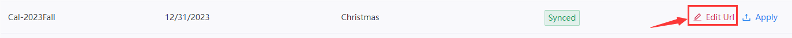
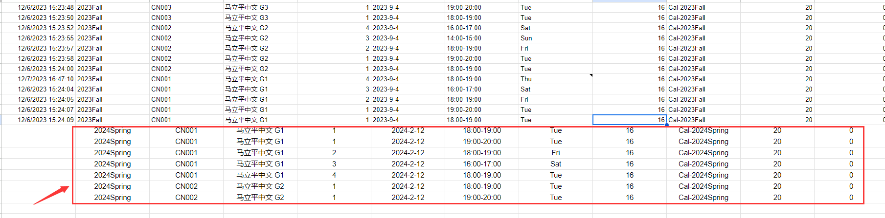
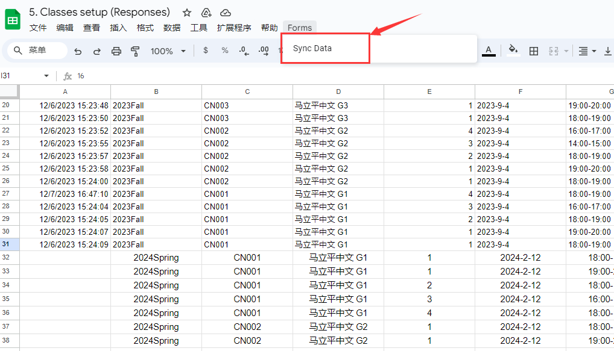
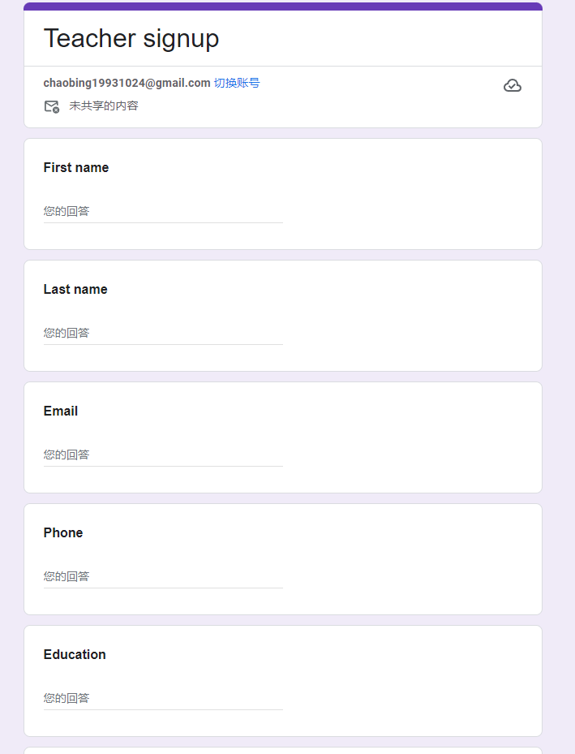
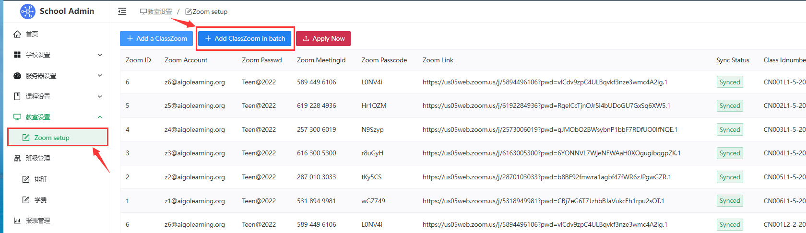

# Admin
## Setup Steps
  - #1 School Setup -> 
  - #2 Form Setup -> 
  - #3 Courses/Class Setup -> 
  - #4 Teacher/Student Setup -> 
  - #5 Discount Setting -> 
  - #6 Tuition Process -> 
  - #7 Classroom/Zoom Setup -> 
  - #8 Assign Teacher/Student to Class


## #1 School Setup

  - 1.Log in to the Admin dashboard.

      https://demo.thinkland.ai/manage （Open the school's own dashboard link）

      Enter the username and password to log in to the management background.
    
  - 2.Account Setup
 
      You can set the management account information (user name, email address, login password, and contact information) for logging in to the Dashboard. The account information has been set by default. You can skip this step.
      
  - 3.Site Setup

      Set the website information, mainly set the Logo picture, website URL, and the full name and abbreviation of the school name.
      
  - 4.FrontPage Setup

      Used to set the banner picture and FrontPage content of the homepage of the learning platform.
      
      
  - 5.Email Setup

      Set the email address, which is used to send notifications. The SMTP server of Email SMTP and Gmail is smtp.gmail.com:465. Email signature indicates the signature of an email
       
  - 6.Payment Setup

      The payment account is mainly used to set up the tuition payment. Currently, Zelle, Paypal, check and cash can be set up. Without a payment account, students cannot pay tuition.

      
       
## #2 Form Setup

  - First log in to the school's own dedicated Google account, and then create a blank folder under My Drive, the folder name format is 'XX LMS Form', XX is the school name abbreviation.
    
      

  - Then share the new empty folder with editor privileges at school@thinkland.ai.
    
      
      
      
    
  - Thinkland will copy the required forms and Excel to this folder and configure them to the Dashboard.

## #3 Courses/Class Setup

     For steps, refer to `1. Course setting:` in the directory, which mainly sets the course system, the school calendar setting, the creation of new semester classes, and finally generates the schedule page.

     The order of operation is `Courses setup` → `Calendar setup` → `Class setup`
    
## #4 Teacher/Student Setup

     To set the teacher, first enter the teacher information into the system. Refer to `2.1  Teacher setup` for steps. Then enter the teacher into the specific class. Refer to `3.1  Teacher-into-Class`. This way students can see the teacher information on the schedule page when they register.

     If necessary, you can input student information into the system and directly help students generate an account. Refer to `2.2  Student setup`. If no entry is required, students can register their accounts by themselves.
    
## #5: Discount setting

     If there is a need for registration discounts, you can set a discount in the system before letting the student register. Refer to `4. Tuition/Discount Management:` for steps.

## #6: Tuition confirmation

     After the student registration, if a student has paid the tuition fee, go to the system to confirm the receipt of the payment. Refer to `4. Tuition/Discount Management:` 

## #7: Assign Zoom/classroom before class

     Zoom/classroom needs to be assigned before class. Please refer to `5.Classroom Management`.

## #8: Send class information to the student/teacher

     Before class, the class information should be sent to the students and teachers in the class. For details, refer to `1.4  Class Schedule`.


## + Topics
  - 1.Course settings：
    - 1.1  Courses setup
    - 1.2  Calendar setup
    - 1.3  Class setup
    - 1.4  Class Schedule

  - 2.Personnel settings：
    - 2.1  Teacher setup
    - 2.2  Student setup

  - 3.Personnel settings：
    - 3.1  Teacher-into-Class
    - 3.2  Student-into-Class

  - 4.Tuition/discount management：

  - 5.Classroom Management：
    - 5.1  Manual setup
    - 5.2  Auto setup

  - 6.Class management：
    - 6.1  Class Info
    - 6.2  My Class
    - 6.3  Class Change

  - 7.Report management：

## + Curriculum template
Curriculum template：[Download CN2023Fall template](https://docs.google.com/spreadsheets/d/1QAmq8u0FTpH0yW1oYq4VSYy8cWICmDdd/edit?usp=sharing&ouid=107518923175762945796&rtpof=true&sd=true)
  
## 1.1 Courses setup

### A.Single course entry and single course classification creation

  - Click `Add a course`.
       
       
  - Fill out the Courses Setup Google form.
       
       
    
  - After filling out the Google form, return to the administration background. You will see the newly entered courses. Click the 'Apply' button in the far right to complete the entry of each  course and generate the course classification.
       
           

### B.Batch entry of multiple courses to create course classification

  - Click `Add courses in batch`.
       
  - Jump to the online Excel table corresponding to the Google form, and then copy the course information to be entered into the Excel table according to the corresponding format.
       
  - Then click 'Forms' at the top, then 'Sync Data', and the system will automatically synchronize Excel data to the background.
       
  - Return to the admin background and click 'Apply Now' to complete the batch entry process.
       
       
### C.Edit course Info
  - To modify the entered course information, you can click 'Edit Url', enter the form to modify the course information, and submit it again. Then click the 'Apply' button again after going back to the background to synchronize the modification content and complete the modification of a single piece of data.
      
  - If multiple course information needs to be modified, you can click 'Add courses in batch', enter the online Excel table to modify the course information, and then click 'Sync Data' to synchronize the modified data to the background, and then click 'Apply Now' button again to synchronize the modified content to complete the modification of multiple course information.
      

## 1.2  Calendar setup

### A.Single calendar entry:
  - Click`Add a Date`.
       
  - Fill out the Class Calendar Setup Google form.
     
       
  - After filling out the Google form, go back to Admin, you will see the newly entered calendar, then click the 'Apply' button on the right to complete the individual calendar entry.
       
       
### B.Multiple calendars are entered in batches：
  - Click`Add Calendar in batch`.
       
  - Go to the online Excel table corresponding to the Class Calendar Setup Google form, and copy the calendar information to the Excel table in the corresponding format.
       
  - Then click 'Forms' at the top, then 'Sync Data', and the system will automatically synchronize excel data to the background.
       
  - Return to the admin background and click 'Apply Now' to complete the batch entry process.
       
       
### C.Edit Calendar Info：
  - To modify the entered calendar information, you can click 'Edit Url', enter the form to modify the course information, and submit it again. Then click the 'Apply' button again after going back to the background to synchronize the modification content and complete the modification of a single piece of data.
      
  - If you need to modify multiple Calendar information, you can click 'Add Calendar in batch', enter the online Excel table to modify the calendar information, and then click 'Sync Data' to synchronize the modified data to the background. Then click 'Apply Now' button again to synchronize the modified content to complete the modification of multiple calendar information.
      

### D.Automatic holiday email reminders (one week before the start of the holiday)

   ```

   Reminder：no AI005L1-25-2023M class on 7/4

   Hello Sreya,

   Just a friendly reminder that there is no AI005L1-25-2023M class at pm on 7/4 due to Independence Day.

   Thank you

   ```

## 1.3  Class setup
### A.Single class entry：
  - Click`Classes setup` and `Add a class`.
       
  - Fill out the Classes setup Google form.
       
       
  - After filling out the Google form, return to the admin background, you will see the newly entered class, and then click the 'Apply' button on the right to complete the entry of a single class.
       
       
### B.Multiple classes batch entry：
  - Click`Add Classes in batch`.
       
  - Jump to the online Excel table corresponding to the Classes setup Google form, and then copy the class information to the excel table according to the corresponding format.
       
  - Then click 'Forms' at the top, then 'Sync Data', and the system will automatically synchronize Excel data to the background.
       
  - Return to the admin background and click 'Apply Now' to complete the batch entry process.
       
       
### C.Edit Class Info：
  - If you need to modify the entered class information, you can click 'Edit Url' to enter the form to modify the class information, and submit it again. After going back to the background, click 'Apply' button again to synchronize the modification content and complete the modification of the data of a single class.
      
  - If you need to modify the information of multiple Classes, you can click 'Add Classes in batch', enter the online excel table to modify the teacher information, and click 'Sync Data' to synchronize the modified data to the background. Then click the 'Apply Now' button again to synchronize the modified content to complete the modification of multiple class information.
      


## 1.4  Class Schedule
   - Students register for courses independently, and administrators manually import student schedules, which will be displayed in the online schedule in real time.
   - Click 'Class' - 'Scheduing' to view.
   - The left drop-down menu allows you to select a different semester to display the courses for the corresponding semester, and 'Active Class' displays all classes currently in session.
   - It can also be filtered by class/student order status, currently divided into:
     - 'All' indicates all classes.
     - 'Processed' shows all classes that have sent class information emails.
     - 'Not Processed' displays all classes that have not yet sent class information emails.
     - 'Paid' shows all current paid students.
     - 'Unpaid' shows all current unpaid students.
  - In the search box on the right, you can search for the class according to the student's name or the teacher's name.
      
     
### A. Schedule Default Settings
  - To Set the Schedule page to display classes, first select the semester that the Schedule page will display by default from the drop-down menu, and then click the 'Set Default Schedule' button on the right.
      

### B. Schedule page Warranty pop-up window content Settings
  - To set the content of the Warranty popup window on the Schedule page, click the 'Warranty' button on the right. You can also set whether to display the Warranty popup window.
      
      
      
    
### C. Student payment status/Manual tuition order generation for non-self-enrolled students
  - Student payment status is divided into three categories:
     - 'Scheduled': means that the student is currently enrolled in the course, but has not paid.
     - 'Add Order': means the student is entered into the class by the administrator, and the student did not register by themselves. The administrator needs to click 'Add Order' to help the student generate the order.
     - '$XXXX' : The specific amount displayed indicates that the student has registered and paid the corresponding amount of tuition.
      

### D. Student/teacher message sending (sent before the first class)
  - After all classes are set up, students/teachers need to be sent a class information email before the first class.
  - Click the Email address of the student/teacher and then click 'Send ClassInfo Email' to send the class with one click. After sending the class, the overall color will change from yellow to green.
      
        
      
    
### E. Tuition Payment Reminder Email (automatic/manual)

   - If the payment is not made within 2 days after the user registers or the administrator manually generates the order, the system will automatically send the tuition payment reminder email and send it again 7 days later. If the payment is not made after 10 days, the order will be deleted.

   ```

Subject:Payment Reminder: to complete registration

Dear Elizabeth Li,

To complete your class registration, please use the link to pay:
- https://thinkland.ai/payment/320/Invoice-8_Elizabeth Li
- CN001L1-F5 马立平中文 G1 Tue 18:00-19:00 ET

If you have already paid, please ignore this email.

Thank you,
Thinkland.AI Demo

   ```
   - Administrators can also click the 'Sender Mail' button on the far right to manually send the tuition payment reminder email
      
   ```

   主题：AI class tuition 夏季课程学费

   Mark Zhou 家长 你好，

   收到Mark的夏季课程报名：
   1、AI005L1-M24 Java Mon-Fri 13:30-15:00 ET
   上课日期：06/19/2023 - 06/30/2023, 2 weeks, 10 classes

   学费：$20.00 per hour x 1.5 hours x 10 classes = $300

   支付请到：https://thinkland.ai/payment/300/Invoice-15146_Mark Zhou （推荐使用Zelle,没有手续费）。
   有任何问题，请邮件直接回复或关注我们的微信公众号：ThinklandAI

   谢谢
   Elaine
   Thinkland.ai Office

   ```
       
## 2.1  Teacher setup
### A.Single teacher input:
  - Click`Add a teacher`.
       
  - Fill out the Teacher signup Google form.
       
       
  - After filling out the Google form, return to the administration background, you will see the newly entered teacher, click the 'Apply' button on the right to complete the entry of a single teacher.
       
       
### B.Multiple teachers batch input：
  - Click`Add Teachers in batch`.
       
  - Jump to the online Excel table corresponding to the Teacher signup Google form, and copy the teacher information to the excel table according to the corresponding format.
       
  - Click 'Forms' at the top, then 'Sync Data', and the system will automatically synchronize Excel data to the background.
       
  - Return to the admin background and click 'Apply Now' to complete the batch entry process.
       
       
### C.Edit Teacher info:
  - If you need to modify the entered teacher information, click 'Edit Url' and submit the form again. After going back to the background, click the 'Apply' button again to synchronize the modification content and complete the modification of a single teacher data.
      
  - If you need to modify multiple teacher information, you can click 'Add Teachers in batch', enter the online excel table to modify the teacher information, and click 'Sync Data' to synchronize the modified data to the background. Then click the 'Apply Now' button again to synchronize the modified content to complete the modification of multiple teacher information.
      
    
## 2.2  Student setup
### A.Single class entry:
  - Click`Add a Student`.
       
  - Fill out the Student signup Google form.
       
       
  - After filling out the Google form, return to the admin background, where you'll see the newly entered students. Click the 'Apply' button on the right to complete the individual student entry.
       
       
### B.Multiple students batch entry:
  - Click`Add Students in batch`.
       
  - Jump to the online Excel table corresponding to the Student signup form, and then copy the student information to the Excel table according to the corresponding format.
       
  - Then click 'Forms' at the top, then 'Sync Data', and the system will automatically synchronize excel data to the background.
       
  - Return to the admin background and click 'Apply Now' to complete the batch entry process.
       
       
### C.Edit Student Info：
  - If you need to modify the input student information, you can click 'Edit Url', enter the form to modify the student information and then submit it again. After going back to the background, click 'Apply' button again to synchronize the modification content and complete the modification of individual student data.
      
  - If you need to modify multiple student information, click 'Add Students in batch', enter the online Excel table to modify the student information, and then click 'Sync Data' to synchronize the modified data to the background. Then click the 'Apply Now' button again to synchronize the modified content to complete the modification of multiple student information.
      

    
## 3.1  Teacher-into-Class
   - Teacher scheduling requires the Class ID, which can be obtained from the Class ID column in Classes setup.
       
     
### A.Individual teachers arrange classes：
  - Click`Assign a teacher`.
       
  - Fill out the Teacher setup Google form.
       
       
  - After filling out the Google form, return to the admin backgroun. You will see the new teacher, then click the 'Apply' button on the right to complete the individual teacher scheduling.
       
       
### B.Multiple teachers arrange classes：
  - Click`Assign Teachers in batch`.
       
  - Jump to the online Excel table corresponding to the Teacher setup Google form, and then copy the teacher information to be formatted into the Excel table according to the corresponding format.
       
  - Then click 'Forms' at the top, then 'Sync Data', and the system will automatically synchronize excel data to the background.
       
  - Return to the admin background and click 'Apply Now' to complete the batch entry process.
       
       
### C.Edit teachers arrange classes：
  - To modify the arranged teacher information, click 'Edit Url' to enter the form to modify the teacher scheduling information, and submit it again. After going back to the background, click the 'Apply' button again to synchronize the modification content and complete the modification of a single teacher's scheduling.
      
  - If you need to modify the information of multiple assigned teachers, you can click 'Assign Teachers in batch', enter the online Excel table to modify the assigned teacher information, and then click 'Sync Data' to synchronize the modified data to the background. Then click the 'Apply Now' button again to synchronize the modification content and complete the modification of multiple scheduling teachers.
      
    

## 3.2  Student-into-Class
  - The Class ID is required to assign a class to an unenrolled student, which can be obtained from the Class ID column in Classes setup.
       

### A.Individual students arrange classes：
  - Click`Assign a student`.
       
  - Fill out the Student setup Google form.
       
       
  - After filling out the Google form, return to the admin background, you will see the new class. Click the 'Apply' button on the right to complete the individual student placement.
       
       
### B.Multiple students arrange classes：
  - Click`Assign students in batch`.
       
  - Jump to the online Excel table corresponding to the Student setup Google form, and then copy the information of the students to be scheduled into the Excel table according to the corresponding format.
       
  - Then click 'Forms' at the top, then 'Sync Data', and the system will automatically synchronize excel data to the background.
       
  - Return to the admin background and click 'Apply Now' to complete the batch entry process.
       
       
### C.Edit students arrange classes：
  - To modify the scheduled student information, click 'Edit Url', enter the form to modify the student scheduling information, and submit it again. Click the 'Apply' button again after going back to the background to synchronize the modification content and complete the modification of the single student scheduling.
      
  - If you need to modify the information of multiple scheduled students, you can click 'Assign students in batch', enter the online Excel table to modify the information of scheduled students, and then click 'Sync Data' to synchronize the modified data to the background. Then click the "Apply Now" button again to synchronize the modification content to complete the modification of multiple students.
      
    
## 4. Tuition/discount management
   - Students register for courses independently and administrators manually generate orders, which will be displayed in real time in the tuition list.
   - The search box on the left allows you to enter the student's name to search all the student's orders.
   - The payment status is divided into three categories:
     - 'Unpaid' means that the student is currently only registered and has not paid.
     -'To be Confirmed' means that the student has paid the tuition fee but the administrator has not confirmed whether the model has been received.
     -'Paid' means that the student has paid the tuition fee and the administrator has confirmed receipt of the model.
      

### A. Payment received confirmation
   - The administrator needs to click on 'Comfirm Payment' after receiving the student's payment.
      
   - Click 'Approve' to confirm the receipt of the payment and send an email to the student reminding them that the payment has been received and the order has been completed.
      
   ```
Subject：Your Class Signup - Paid

Dear William Cao,

This is to confirm your signing up for the following class:
- CN003L1-F5 马立平中文 G3 Tue 18:00-19:00 ET 12/19/2023 - 12/19/2023, 16 weeks, 16 classes

Your payment has been received.
You can view class information at: https://demo.thinkland.ai/classorder/40


Thank you,
Thinkland.AI Demo

   ```
### B. Payment are tied to student orders
   - After receiving the student's payment bill email, the system will automatically capture the payment bill information and display it on the payment page.
      
   - If you receive cash or a check, you can add payment offline by clicking the Add button in the upper left corner.
      
   - After the administrator confirms the student's payment on the Tuition page, they need to go to the Payment page to bind the student's order with the payment bill. If the Invoice information is noted when the parent pays, the system will automatically identify and bind the payment bill with the student order corresponding to the Invoice without manual intervention. If the parent does not note the Invoice information when paying, the administrator needs to manually enter the corresponding Invoice information to complete the binding.
      
   - The Invoice information is available on the Tuition page. Each student order has unique Invoice information.
      
     
### C. Refund confirmation
   - When the administrator receives the student's Refund application and returns the money to the student, he or she needs to click 'Check Refund'.
      
   - Enter the refund amount, click 'Approve' to complete the refund process, and email the student a reminder of the refund.
      
   ```
Subject：Class refund confirm: CN002L1-F5 马立平中文 G2 Tue 18:00-19:00 ET

Dear Catherine,

Your class refund has been confirmed.

Best Regards,
Thinkland.AI Demo
 
   ```
### D. Students change classes
   - When students need to change classes, they need to refund the original order first and click the View button of the original order on the Tuition page.
      
   - Jump to the Order screen and click the refund button.
      
   - Go Back to the Tuition page, click 'Check Refund', enter the amount, check 'Back to Credit', and click 'Approve' to complete the refund process of the original order and return the student's fee to the student's Credit account.

      

   - Then let the student re-enroll or let the administrator help the student enroll in the new class, and the returned Credit will be automatically deducted when the new class tuition is paid.

### E. Order deletion
   - When the administrator needs to Delete a student's order, click the 'Delete' button on the right of the order.
      

### F. Preview student order list
   - When the administrator needs to preview a student's order, click the 'View' button on the right of the student's order.
   - You can also directly enter the student order list through this button to help students apply for a refund or change the payment status.
      
     
### G. Discount setting
   - Click the 'Add' button of discount to set up the tuition discount activity.
   - At present, the discounts supported are divided into four ways:
      - 1.增加收费，such as tuition and miscellaneous fees, book fees, exam fees and other additional fees.
      - 2.减少收费，such as setting up activities like immediately reducing payment.
      - 3.收费折扣，such as 10% off early bird price and other activities.
      - 4.多人折扣，such as family discounts and the overall fee discount for multiple children in one family.
     
      
     
   - Coupon Name: Enter the coupon name.
   - Content: Fill in the specific promotional content.
   - Coupon Type: indicates the discount mode.
   - Amount: Fill in the specific amount/discount of the offer.
   - Description: indicates the specific promotional information.
   - Start Date: Set the start date of the offer.
   - End Date: specifies the promotional end date.
   - Apply to: Set which courses can participate in this offer. If you do not fill in the default, all courses can participate in this offer.

      
 
## 5.1  Manual setup
  - Setting up Zoom for a Class requires the Class ID, which can be obtained from the Class ID column in Classes setup.
       
    
### A.Zoom is set for individual classes：
  - Click`Add a ClassZoom`.
       
  - Fill out the Classroom/Zoom setup Google form.
       
       
  - After filling out the Google form, go back to Admin and you will see the newly set Zoom class, then click the 'Apply' button on the right to set Zoom for each class.
       
       
### B.Multiple classes set Zoom：
  - Click`Add ClassZoom in batch`.
       
  - Jump to the online Excel table corresponding to the Classroom/Zoom setup Google form, and copy the class information about Zoom to the Excel table according to the corresponding format.
       
  - Then click 'Forms' at the top, then' Sync Data ', and the system will automatically synchronize excel data to the background.
       
  - Return to the admin background and click 'Apply Now' to complete the batch entry process.
       
       
### C.Edit the class Zoom information：
  - To modify the zoom information that has been set, you can click 'Edit Url', enter the form to modify the student scheduling information, and submit it again. Click the 'Apply' button again after going back to the background to synchronize the modification content and complete the modification of Zoom for a single class.
      
  - If you need to modify the Zoom information of multiple classes, you can click 'Add ClassZoom in batch', enter the online excel table to modify the Zoom information of the class, and click 'Sync Data' to synchronize the modified data to the background. Then click the "Apply Now" button again to synchronize the modification content and complete the modification of Zoom for multiple classes.
       
    
## 5.2  Auto setup

### A.Enter the Zoom account that can be used for automatic assignment
   - Click the Zoom management of 'Home' to enter the APPzoom management page.
       
     
  - Check 'Individual Input' for 'Zoom Accounts'.
       
    
  - Click 'Sample File' to download the zoom account import template.
       

  - Enter the account information according to the template, click 'Select file' to upload the file, and then click 'Submit' to complete the Zoom account import.
       

### B.Automatically assign a Zoom account to the class
  - Click on 'Class'-'Scheduling', then click on the name of the class to set the Zoom, it will jump to the corresponding class page.
       
  - Click the Class Settings button in the upper right corner of the class page.
       
  - Click 'Edit course setting' to enter the class setting.
       
  - Click the 'Sync out' button of Zoom Sync, and the system will automatically assign a Zoom to the class.
       
    
## 6.1  Class Info

   - Click 'Class' - 'Scheduling' - 'Daily Class Info' to view the situation of each class, teachers and students in real time every day.
      
           

## 6.2  My Class
   - Click to open[My Class](https://demo.thinkland.ai/myclass/)
   - Enter the name of the student/teacher in the input box to view the current courses and past courses of the student/teacher.
      

## 6.3  Class Change

   - Click 'Class' - 'Scheduling' - 'Daily Class Info' to enter the Class Info page.
      
   - Then click the 'Class Change' button to enter the Class Change page.

      
 
### A. The end of the course is automatically postponed if the course is cancelled

  
   - Click 'cancel class' to send the class cancellation notice to the student.

      

### B. Adjust the time of the class or cancel the class and make up for it at another time

  
   - Select the date and time of the adjustment, then Check whether zoom conflicts, and click Update Class to send the course adjustment notification.
      

### C. Permanently adjust class times

  

   - Select the adjustment time and date, check 'Permanent change', check if zoom conflicts, and click Update Class to send the course adjustment notice.

      
  
### D. Substitute teachers make up lessons 

  

   - Once you have found your replacement teacher, click change teacher.
      
   - Enter the replacement teacher's name and click ok.

      

   - Finally, click update class to send an email reminder and complete the replacement teacher operation.
      
      
     
## 7 Report management
### Report Management 1 - Teacher salary chart download
   - Select the date range, enter the Teacher's name, and click 'Export Teacher' to pull up the teacher salary table.
          

### Report Management 2 - Time sheet download

  
  
### Report Management 3 - All students list download

  

### Report Management 4 - All teachers list download

   - Click 'Export' to pull up all teacher information.
   - Click 'Export Current teacher' to pull up the information of all teachers currently in class.
      
