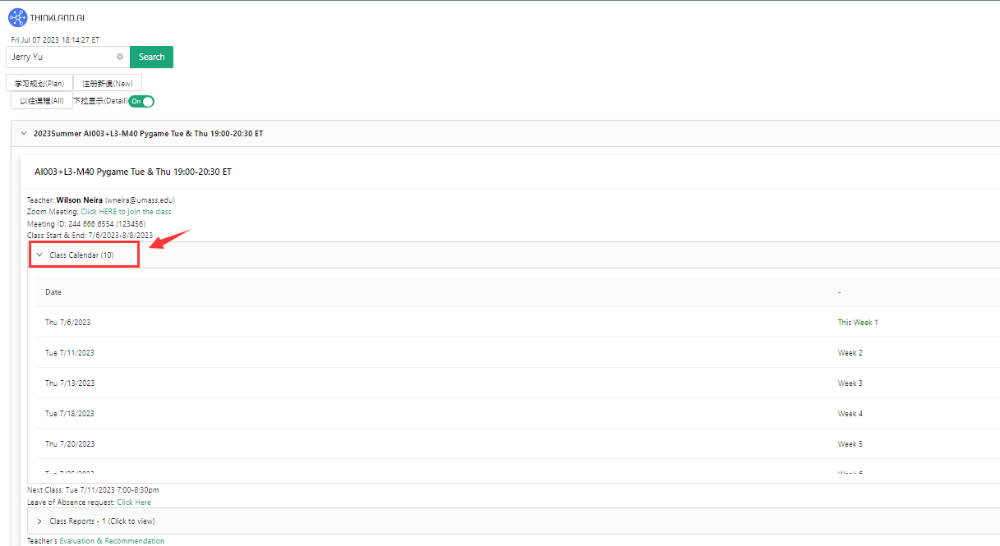

# Student & Parents

## I. Before registration/class
### 1. Self-registration account
   - Open the login interface of the learning platform https://demo.thinkland.ai/login/index.php.
   - Click`Create new account`.
   - Fill in the registration information and click 'Create my new account' to submit.

     
     
     
   - Go to the email address used to register and find the registration confirmation email.
   - Click the link in the email to complete the account registration.
     
     
### 2. Course registration/payment
   - Open https://demo.thinkland.ai/schedule/.
   - Choose your child's next course according to the teacher's recommendation and add it to the shopping cart.
     
     

   - Click 'continue to Checkout' to pay.
     
     

### 3. Class information email
   - The operator will send a class information email to students before the class starts.

### 4. Class calendar inquiry
   - Click https://demo.thinkland.ai/myclass/ and enter the name or email to view the current school calendar information.
     
     

### 5. Class zoom query
   - Click https://demo.thinkland.ai/myclass/ and enter the name or email to view the current class's Zoom information.
 
     

### 6. Ask for leave
   - Click https://demo.thinkland.ai/myclass/ and enter the name or email.
   - Click 'leave of absence request' and then 'Click Here' to submit a leave request.
 
     

     
### 7. Parent mail Setup
   - Method 1: Students use their own account to log in to the learning platform, open the MyClass page to enter the student's name, and then click the "parent Email" in the upper right corner of Myclass.
 
     
     

   - Method 2: On the order payment page, go to the Settings page of 'Add Family member' to add the Parent mail settings.

     

## II. After class
### 1. Report view
   - Click https://demo.thinkland.ai/myclass/, enter the name or email.
   - Click 'Class Report' to drop down to view all class reports.
 
     

### 2. Evaluation View
   - Click https://demo.thinkland.ai/myclass/, enter the name or email.
   - Click on 'Evaluation& Recommendation' to pull down to see the teacher rating.
 
     

### 3. To continue class remind
   - When there are 2 classes left in the class, the system will automatically send the first continuation reminder email.
    

   - When there is one lesson left in the class, the system automatically sends a second reminder email.
  

   - When the class is over, the system automatically sends a third reminder email.
  

### 4. Refund application
   - When you need to request a refund, log on to the learning platform.
   - Click the shopping cart button in the upper right corner of the learning platform.
  

   - Click on All CLASS, find the order to be refunded, and click the refund button to send a refund request.
  
